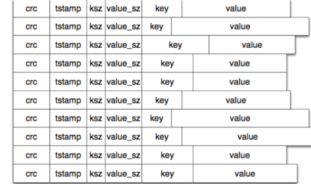

# BitCask介绍
> 论文出处： https://riak.com/assets/bitcask-intro.pdf    

BitCask是本地kv存储。本地意味着存储在当前主机，没有涉及到跨主机交互。  

# 模型：
* 磁盘
  * BitCask目录，只允许一个写进程打开该目录进行写操作
  * BitCask目录下有很多文件
    * 活跃文件：active file，只有1个
      * 提供追加写入
      * 文件被关闭(主动、故意、服务退出等)，就认为是不可变的，永远不能被打开再写入；
        * 主动关闭：文件大小超过阈值，它将被关闭，并创建一个新的活动文件
    * 历史文件：old file，有多个
  * BitCask文件中key/value数据格式(条目)：
    * crc：校验该条数据
    * timestamp：时间戳，32位int
    * keySize：key的长度
    * valueSize：value的长度
    * key：key的内容
    * value：value的内容
* 内存
  * KeyDir：key的索引目录
    * 写入key/value时，磁盘活跃文件追加操作完成后，会被更新
    * 是一个简单的哈希表，
      * key是写入的key，
      * value是写入key的相关信息：
        * key所在的文件
        * key所在的文件中的偏移量
        * value的大小
        * value所在的位置
        * 最近更新的时间戳
    * KeyDir中保存的是最新写入的key和对应的value
      * 旧的数据仍然保存在磁盘上，但是读取时通过KeyDir会读到最新写入的版本
      * 合并过程merge会删除掉旧的数据
    * 
  * 

磁盘中BitCask文件中key/value数据结构：

# 操作：
* 读操作get(key)：
  * 一次内存操作：从KeyDir中找到key对应的文件、value的位置和value的大小
  * 一次磁盘寻道操作：根据文件、value的位置和value的大小，从指定文件中的指定位置读取指定大小的数据，即为value的值
  * 优化：使用到操作文件系统的预读缓存。todo @lq 进一步补充

* 写操作
  * 写磁盘文件
    * 只有一个进程打开BitCask目录，进行写操作
    * 如果写的时候发现Active文件到达阈值，关闭Active文件，重新生成一个Active文件
    * 写一个条目到Active文件中
  * 更新内存中的KeyDir
  * 注意：如果已写的key存在，在磁盘文件中现在是不会删除的，在内存中的KeyDir会被更新。

* 删除操作
  * 先把KeyDir中对应的key给删除
  * 在磁盘Active文件中追加一条目录，timestamp为0，表示删除。条目中其他数据是从KeyDir中获取的

* 合并操作
  * 目的：更新、删除key都是在文件中追加的方式，长期下来很耗空间。清除无用的数据。
  * 时机：后台进行，不影响正常读写
  * 遍历所有非活跃文件(旧文件)，
    * 写入一个merge文件：如果文件的key在KeyDir中存在，并且timestamp、文件ID和value偏移量相同，说明是最新的，就写入到merge文件中
      * 注意：merge文件是一组文件；merge文件写成后也永远不会被写入
    * 写入一个hint文件：将上面写入merge文件的时间戳、key的长度、value的长度和key写入到hint文件中，作为索引文件
    * 删除旧文件
    * 重命名merge文件为旧文件
    * 更新KeyDir ==》论文中没写这个
> merge时，读取正好merge文件中key，要同时支持读写。

启动：
* 启动后，所有文件都是old data file。如果存在hint，就把hint加载到KeyDir，否则从data file中加载KeyDir

hint文件的用处：
* 崩溃恢复。当系统崩溃重启时，可以通过hint文件快速构建KeyDir

关系：
* 1个KeyDir，对应1个Active Data File，N个Old Data File
* 1个Old Data File可能对应1个Hint File
* 在某个时刻，最多只有一个merge data file

文件命名规则：
* data file：{秒级时间戳}.bitcask.data
* hint file：{秒级时间戳}.bitcask.hint
* merge file：{秒级时间戳}.bitcask.merge

适用场景：
* 所有记录的key能全部载入内存
* value的大小一定要比key大很多，否则不如直接写到内存中。另外value不能太大，因为写入是串行的。
* 连续写入，随机读取

# 问题点
1. 关闭active文件的阈值？

2. merge文件的时机？

# todo
-[ ] 中文文档统一翻译英文

